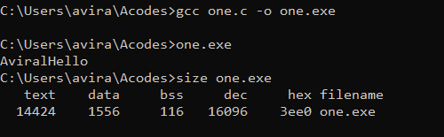
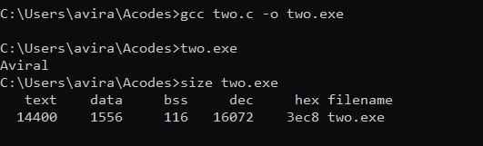
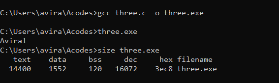
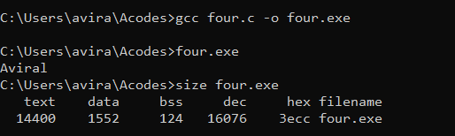
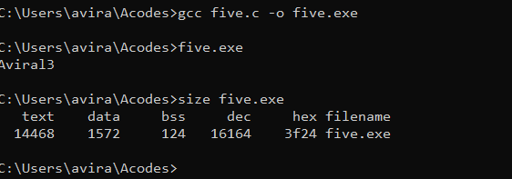

# (Initial Source Code)
```
#include<stdio.h>
void disp()
{
        printf("Hello");
}
int d=123;
static int s;
int main(){
	printf("Aviral");
        disp();
        return 0;
}
```


# (Upon changing the print string we see a change in text but bss and data remains same)
```
#include<stdio.h>
void disp()
{
        printf("");
}
int d=123;
static int s;
int main(){
	printf("Aviral");
        disp();
        return 0;
}
```


# (Now upon changing the initialised state we change in both data and bss)
```
#include<stdio.h>
void disp()
{
        printf("");
}
int d;
static int s=0;
int main(){
	printf("Aviral");
        disp();
        return 0;
}
```

# (Now adding more global varibles we see a change in bss)
```
#include<stdio.h>
void disp()
{
        printf("");
}
int d;
static int s=0;
int e;
int main(){
	printf("Aviral");
        disp();
        return 0;
}
```

# (Now adding pointer for DMA)
```
#include<stdlib.h>
#include<stdio.h>
void disp()
{
        printf("");
}
int dd;
static int s=0;
int e;
int main(){
	printf("Aviral");
	scanf("%d",&dd);
  	int *ptr = (int*) malloc(dd * sizeof(int));
        disp();
        return 0;
}
```

#
Name : Aviral Kumar Srivastava
Roll No :. 20
SAP ID : 500068442
Class : CSE IOT B1
RTOS LAB 0
