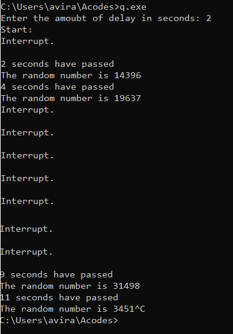

# SOURCE CODE

```C
#include <stdio.h> 
#include <conio.h>
#include <time.h> 
#include <stdlib.h>
int counter=0;
void delay(int seconds_delay) 
{ 
	clock_t start, end;
	int ms = 1000 * seconds_delay; //The seconds recieved from the user as an input are converted into milliseconds here.
	clock_t ct = clock(); //this is very efficient to use in this manner	
    	char ch;		//to store the char input from keyboard press
    	int count=0;		//a flag variable to check for point of entry into the else segment
      //made by aviral
    	start=clock();
    	while (clock() < ct + ms)		//loop till it doesn't reach delay time
    	{    		
    		if(kbhit())		//This function gives a boolean output from the keyboard press
    		{
    			ch=getch();
    			if((int)ch == 27)
    			{
    				exit(0);			//exit because esc key is pressed
    			}
    			else
    			{
    				count++;
    				printf("\nInterrupt.\n");
    				end=clock();
    				counter += end - start;
    				break;
    			}
    		}
    	}
    	if(count!=0)
    	{
		delay(seconds_delay);
	}
    	else
    	{
    		end=clock();
    		counter += end - start;
    	}
} 
int main()
{ 
	int i; 
	int dy;
	char ch;
    	srand(time(0)); //seeding the function
        printf("Enter the amoubt of delay in seconds: ");
        scanf("%d",&dy);
        //Made by aviral
        //Currently this loop will run for a 1000 seconds without interuption
        printf("Start:");
    	for (i = 0; i < 1000; i+=dy) 
    	{
    		delay(dy);
        	printf("\n%d seconds have passed\n", (counter/1000)); 
        	printf("The random number is %d",rand());
    	}
    return 0; 
}
```

# OUTPUT



#
Name : Aviral Kumar Srivastava
Roll No : 20
SAP ID : 500068442
Class : CSE IOT B1
RTOS LAB 0

