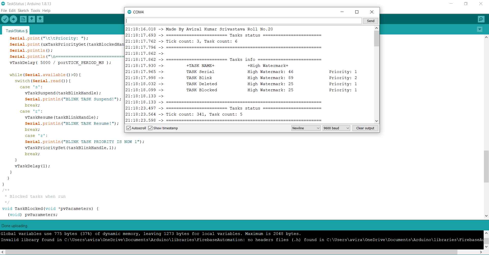
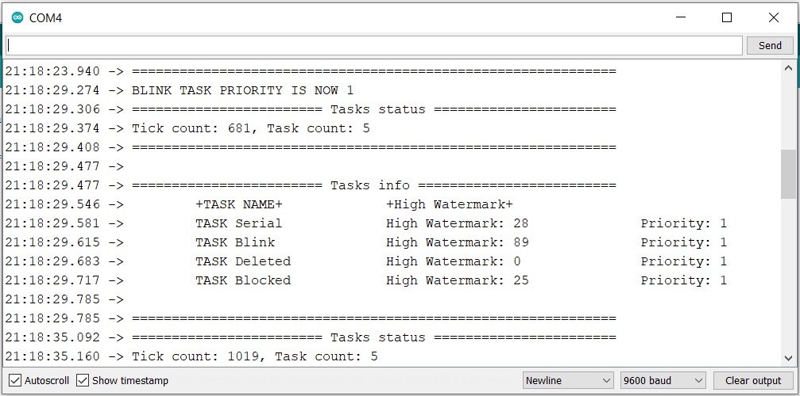
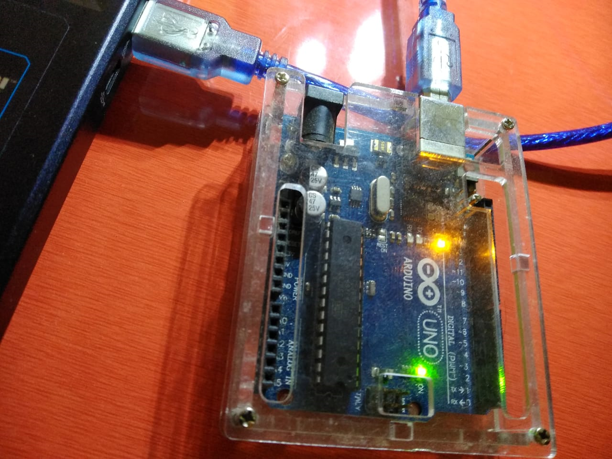
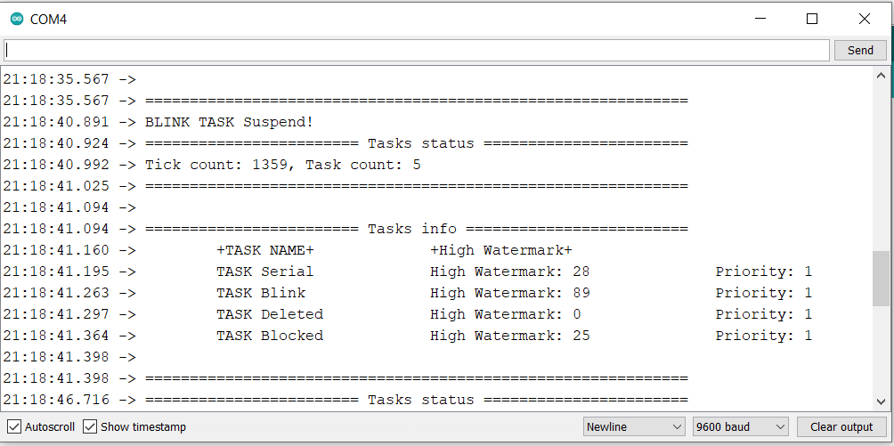
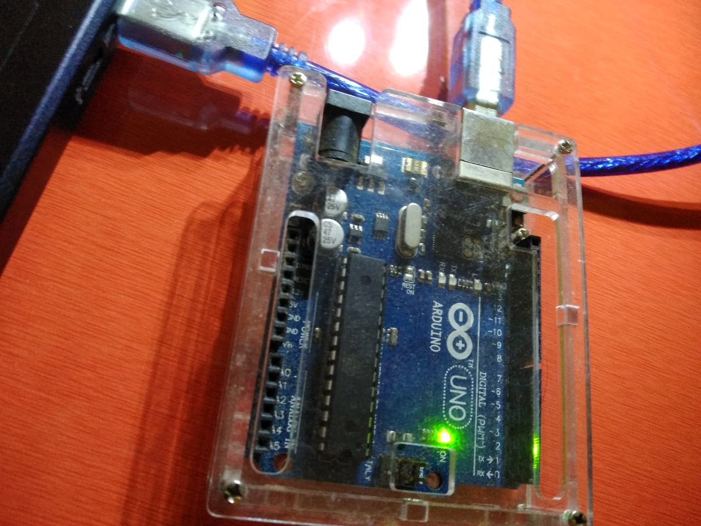
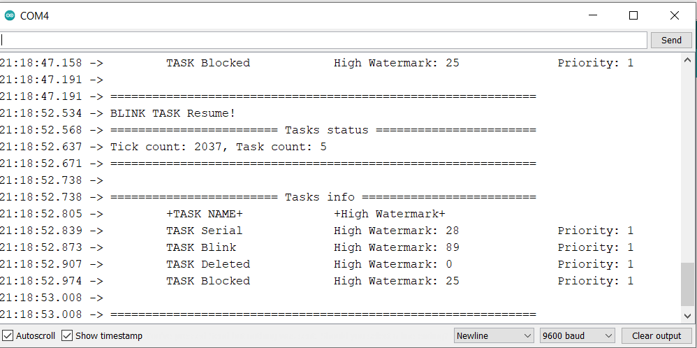

## Introduction about the Task Control Functions.
#
* a.	**vTaskDelay()** specifies a time at which the task wishes to unblock relative to the time at which vTaskDelay() is called. For example, specifying a block period of 100 ticks will cause the task to unblock 100 ticks after vTaskDelay() is called. vTaskDelay() does not therefore provide a good method of controlling the frequency of a periodic task as the path taken through the code, as well as other task and interrupt activity, will effect the frequency at which vTaskDelay() gets called and therefore the time at which the task next executes.
* b.	**uxTaskPriorityGet()** obtains the priority of any task.
* c.	**vTaskPrioritySet()** sets the priority of any task. A context switch will occur before the function returns if the priority being set is higher than the currently executing task.
* d.	**vTaskSuspend()** suspends any task. When suspended a task will never get any microcontroller processing time, no matter what its priority.
* e.	**vTaskResume()** Resumes a suspended task. A task that has been suspended by one or more calls to vTaskSuspend () will be made available for running again by a single call to vTaskResume ().
* f.	**vTaskGetInfo()** Whereas uxTaskGetSystemState() populates a TaskStatus_t structure for each task in the system, vTaskGetInfo() populates a TaskStatus_t structures for just a single task. The TaskStatus_t structure contains, among other things, members for the task handle, task name, task priority, task state, and total amount of run time consumed by the task.
#
##	Source Code :
```C
#include <Arduino_FreeRTOS.h>
//define task handles
TaskHandle_t taskBlinkHandle;
TaskHandle_t TaskSerial_Handler;
TaskHandle_t taskDeletedHandle;
TaskHandle_t taskBlockedHandle;
// define two tasks for Blink & Serial

void TaskBlink( void *pvParameters );
void TaskSerial(void* pvParameters);

// the setup function runs once when you press reset or power the board
void setup() {
// initialize serial communication at 9600 bits per second:
  Serial.begin(9600);
  while (!Serial){
    ; // wait for serial port to connect. Needed for native USB, on LEONARDO, MICRO, YUN, and other 32u4 based boards.
  }
  Serial.println("Made By Aviral Kumar Srivastava\tRoll No.20");
  // Now set up four tasks to run independently.
   xTaskCreate(
    TaskBlink
    ,  "Blink"   // A name
    ,  128  // This stack size can be checked & adjusted by reading the Stack Highwater
    ,  NULL //Parameters passed to the task function
    ,  2  // Priority, with 2 (configMAX_PRIORITIES - 1) being the highest, and 0 being the lowest.
    ,  &taskBlinkHandle );//Task handle
    
   xTaskCreate(
    TaskSerial
    ,  "Serial"
    ,  128  // Stack size
    ,  NULL //Parameters passed to the task function
    ,  1  // Priority
    ,  &TaskSerial_Handler );  //Task handle

   xTaskCreate(TaskDeleted,
              "Deleted",
              64,
              NULL, 
              1,
              &taskDeletedHandle);

   xTaskCreate(TaskBlocked,
              "Blocked",
              64,
              NULL, 
              1,
              &taskBlockedHandle);
}
void loop()
{
  // Empty. Things are done in Tasks.
}
/*---------------------- Tasks ---------------------*/
void TaskSerial(void* pvParameters){
 (void) pvParameters;
for (;;) // A Task shall never return or exit.
{
   Serial.println("======================== Tasks status =======================");
   Serial.print("Tick count: ");
   Serial.print(xTaskGetTickCount());
   Serial.print(", Task count: ");
   Serial.print(uxTaskGetNumberOfTasks());
   Serial.println("\n=============================================================");
   Serial.println();
   Serial.println("======================== Tasks info =========================");
   Serial.println("\t+TASK NAME+\t\t+High Watermark+");
   
   // Serial task status
   Serial.print("\tTASK ");
   Serial.print(pcTaskGetName(NULL)); // Get task name without handler https://www.freertos.org/a00021.html#pcTaskGetName
   Serial.print("\t\tHigh Watermark: ");
   Serial.print(uxTaskGetStackHighWaterMark(NULL)); // https://www.freertos.org/uxTaskGetStackHighWaterMark.html 
   Serial.print("\t\tPriority: ");
   Serial.print(uxTaskPriorityGet(NULL));
   //Blink task status
   TaskHandle_t taskSerialHandle = xTaskGetCurrentTaskHandle(); // Get current task handle. https://www.freertos.org/a00021.html#xTaskGetCurrentTaskHandle
   Serial.println();
   Serial.print("\tTASK ");
   Serial.print(pcTaskGetName(taskBlinkHandle)); // Get task name with handler
   Serial.print("\t\tHigh Watermark: ");
   Serial.print(uxTaskGetStackHighWaterMark(taskBlinkHandle));
   Serial.print("\t\tPriority: ");
   Serial.print(uxTaskPriorityGet(taskBlinkHandle));
   Serial.println();
   //Deleted task status
   Serial.print("\tTASK ");
   Serial.print(pcTaskGetName(taskDeletedHandle));
   Serial.print("\t\tHigh Watermark: ");
   Serial.print(uxTaskGetStackHighWaterMark(taskDeletedHandle));
   Serial.print("\t\tPriority: ");
   Serial.print(uxTaskPriorityGet(taskDeletedHandle));
   Serial.println();
   //Blocked task status
   Serial.print("\tTASK ");
   Serial.print(pcTaskGetName(taskBlockedHandle));
   Serial.print("\t\tHigh Watermark: ");
   Serial.print(uxTaskGetStackHighWaterMark(taskBlockedHandle));
   Serial.print("\t\tPriority: ");
   Serial.print(uxTaskPriorityGet(taskBlockedHandle));
   Serial.println();
   Serial.println("\n=============================================================");
   vTaskDelay( 5000 / portTICK_PERIOD_MS );
   
   while(Serial.available()>0){
     switch(Serial.read()){
       case 's':
         vTaskSuspend(taskBlinkHandle); 
         Serial.println("BLINK TASK Suspend!");
         break;
       case 'r':
         vTaskResume(taskBlinkHandle);
         Serial.println("BLINK TASK Resume!");
         break;
         case 'z':
         Serial.println("BLINK TASK PRIORITY IS NOW 1");
         vTaskPrioritySet(taskBlinkHandle,1);
         break;
     }
     vTaskDelay(1);
   }
  }
}
/**
 * Blocked tasks when run
 */
void TaskBlocked(void *pvParameters) {
  (void) pvParameters;
  for (;;)
  {
    vTaskDelay( 900000 / portTICK_PERIOD_MS );  
  }
}
/**
 * Deleted tasks when run
 */
void TaskDeleted(void *pvParameters) {
(void) pvParameters;
 vTaskDelete(NULL);
}
/* 
 * Blink task. 
 * See Blink_AnalogRead example. 
 */
void TaskBlink(void *pvParameters)  // This is a task.
{
  (void) pvParameters;
  pinMode(LED_BUILTIN, OUTPUT);
  for (;;) // A Task shall never return or exit.
  {
    //Serial.println(11);
    digitalWrite(LED_BUILTIN, HIGH);   // turn the LED on (HIGH is the voltage level)
    vTaskDelay( 1000 / portTICK_PERIOD_MS ); // wait for one second
    digitalWrite(LED_BUILTIN, LOW);    // turn the LED off by making the voltage LOW
    vTaskDelay( 1000 / portTICK_PERIOD_MS ); // wait for one second
  }
}
```
## Explaination and Output

### We are using ArduinoIDE and Arduino Uno Board.
### The source code is uploaded successfully and the Serial Monitor displays output
### The TASK Serial displays information about the current task.**
### The TASK Blink keeps blinking the LED PIN on the Arduino Uno Board.
### The other 2 tasks are TASK DELETED and TASK BLOCKED**
### The main screen show all the details of the 4 tasks.



### Note initially the priority of TASK Blink is 2 but after we give input “z” it changes to 1.



### The Blinking LED PIN on UNO Board.



### When input “s” is given then the blinking of LED PIN on the board stops. This is because the TASK Blink is suspended. 



### The Blinking of LED stops.



### When input “r” is given then the blinking of LED PIN on the board resumes. This is because the TASK Blink is resumed.



### The Blinking LED PIN on UNO Board resumes blinking. 


##
Name : Aviral Kumar Srivastava
Roll No : 20
SAP ID : 500068442
Class : CSE IOT B1
RTOS LAB 2


